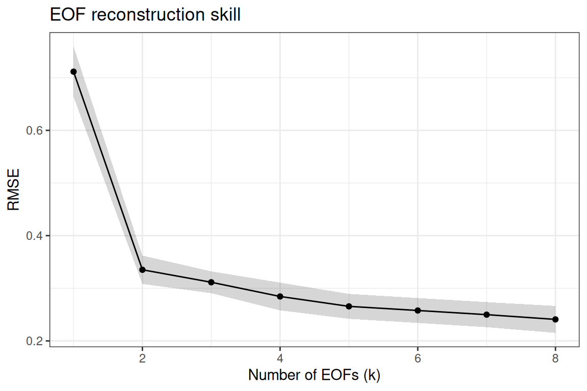
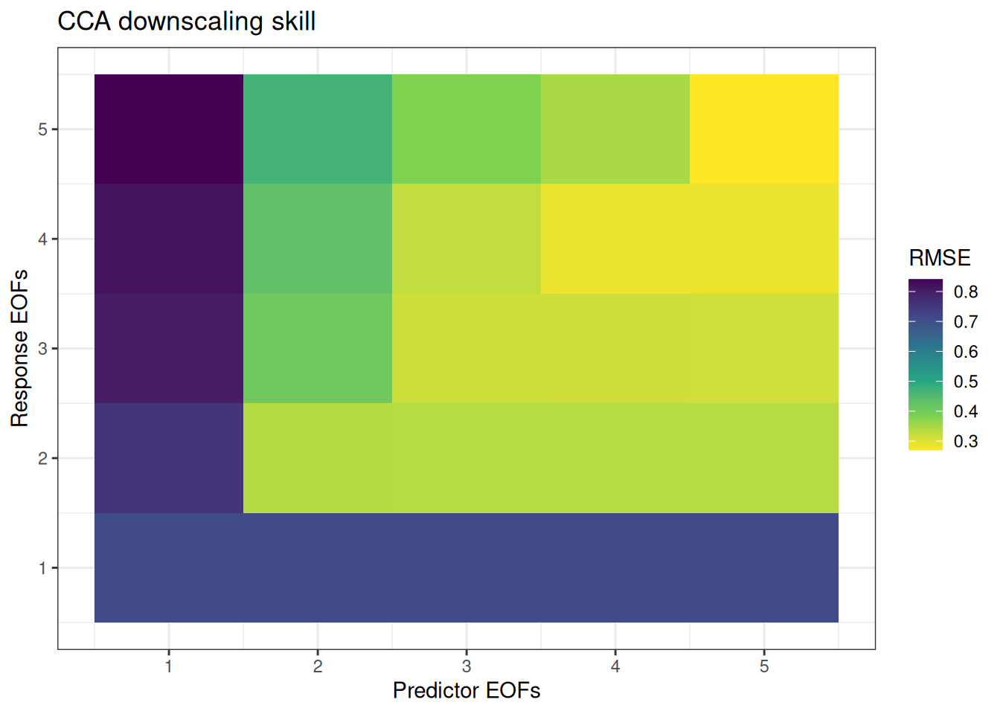

# Cross-Validation and Tuning

``` r
library(tidyeof)
library(stars)
library(dplyr)
library(ggplot2)
```

## Overview

EOF and CCA analyses require choosing how many modes to retain (`k`).
Too few modes discard useful signal; too many introduce noise. `tidyeof`
provides two cross-validation functions for data-driven mode selection:

- [`tune_eof()`](https://nick-gauthier.github.io/tidyEOF/reference/tune_eof.md)
  – optimize EOF truncation for field reconstruction
- [`tune_cca()`](https://nick-gauthier.github.io/tidyEOF/reference/tune_cca.md)
  – jointly optimize predictor EOFs, response EOFs, and CCA modes for
  downscaling

Both use temporal cross-validation: the time series is split into folds,
patterns are estimated on training folds, and reconstruction or
prediction skill is evaluated on held-out folds.

## Setup

``` r
fine <- system.file("testdata/prism_test.RDS", package = "tidyeof") |>
  readRDS()

coarse <- fine |>
  st_warp(cellsize = 0.2, method = "average", use_gdal = TRUE, no_data_value = -99999) |>
  setNames(names(fine)) |>
  st_set_dimensions("band",
    values = st_get_dimension_values(fine, "time"),
    names = "time")
```

## Tuning EOF truncation

[`tune_eof()`](https://nick-gauthier.github.io/tidyEOF/reference/tune_eof.md)
evaluates reconstruction skill across a range of `k` values. For each
fold, it extracts patterns from training data, projects test data onto
those patterns, reconstructs the test field, and compares against the
held-out observations.

``` r
eof_results <- tune_eof(fine, k = 1:8, kfolds = 3)
```

    ℹ Computing patterns for 3 folds

    ✔ Computing patterns for 3 folds [547ms]

    Evaluating 8 k values across 3 folds

``` r
eof_results
```

    # A tibble: 24 × 5
           k  fold  rmse cor_spatial cor_temporal
       <int> <int> <dbl>       <dbl>        <dbl>
     1     1     1 0.807       0.790        0.998
     2     1     2 0.657       0.930        0.998
     3     1     3 0.671       0.922        0.997
     4     2     1 0.389       0.931        0.999
     5     2     2 0.308       0.971        0.999
     6     2     3 0.308       0.974        1.000
     7     3     1 0.353       0.940        1.000
     8     3     2 0.290       0.976        1.000
     9     3     3 0.292       0.976        1.000
    10     4     1 0.336       0.944        1.000
    # ℹ 14 more rows

Three metrics are computed by default:

- **RMSE** – root mean square error (lower is better)
- **cor_spatial** – mean spatial correlation per time step (higher is
  better)
- **cor_temporal** – mean temporal correlation per grid cell (higher is
  better)

Summarize across folds to find the optimal `k`:

``` r
eof_summary <- summarize_eof_cv(eof_results, metric = "rmse")
eof_summary
```

    # A tibble: 8 × 8
          k rmse_mean rmse_sd cor_spatial_mean cor_spatial_sd cor_temporal_mean
      <int>     <dbl>   <dbl>            <dbl>          <dbl>             <dbl>
    1     8     0.241  0.0443            0.975         0.0206             1.000
    2     7     0.250  0.0413            0.974         0.0205             1.000
    3     6     0.258  0.0410            0.973         0.0198             1.000
    4     5     0.266  0.0410            0.972         0.0196             1.000
    5     4     0.284  0.0456            0.969         0.0210             1.000
    6     3     0.311  0.0359            0.964         0.0207             1.000
    7     2     0.335  0.0466            0.959         0.0242             0.999
    8     1     0.711  0.0828            0.881         0.0786             0.998
    # ℹ 2 more variables: cor_temporal_sd <dbl>, n_folds <int>

``` r
eof_results |>
  group_by(k) |>
  summarize(
    rmse_mean = mean(rmse),
    rmse_se = sd(rmse) / sqrt(n()),
    .groups = "drop"
  ) |>
  ggplot(aes(k, rmse_mean)) +
  geom_ribbon(aes(ymin = rmse_mean - rmse_se, ymax = rmse_mean + rmse_se), alpha = 0.2) +
  geom_line() +
  geom_point() +
  labs(x = "Number of EOFs (k)", y = "RMSE", title = "EOF reconstruction skill") +
  theme_bw()
```



## Tuning CCA downscaling

[`tune_cca()`](https://nick-gauthier.github.io/tidyEOF/reference/tune_cca.md)
jointly searches over three dimensions:

- `k_pred` – number of predictor EOFs
- `k_resp` – number of response EOFs
- `k_cca` – number of CCA modes (optional; defaults to
  `min(k_pred, k_resp)`)

### Preparing folds

First, prepare cross-validation folds using
[`prep_cv_folds()`](https://nick-gauthier.github.io/tidyEOF/reference/prep_cv_folds.md).
This pre-computes EOF patterns at the maximum requested `k` for each
fold, so the grid search over truncation is fast (it just subsets the
pre-computed patterns).

``` r
cv_folds <- prep_cv_folds(
  coarse, fine,
  kfolds = 3,
  max_k_pred = 5,
  max_k_resp = 5,
  weight = TRUE
)
```

    ℹ Computing patterns for 3 folds

    ✔ Computing patterns for 3 folds [536ms]

``` r
cv_folds
```

    ── Cross-Validation Folds ──────────────────────────────────────────────────────

    Folds: 3

    Common time steps: 36

    Max predictor EOFs: 5

    Max response EOFs: 5

    ── Pattern Options ──

    Scale (predictor): FALSE

    Scale (response): FALSE

    Rotate: FALSE

    Monthly: FALSE

    Weight: TRUE

### Grid search

``` r
cca_results <- tune_cca(
  cv_folds,
  k_pred = 1:5,
  k_resp = 1:5
)
```

    Evaluating 25 parameter combinations across 3 folds
     ■■■■■■■■■■■■                      36% |  ETA:  5s

     ■■■■■■■■■■■■■■■■■■■■■■■■■         80% |  ETA:  1s

``` r
cca_results
```

    # A tibble: 75 × 7
       k_pred k_resp k_cca  fold  rmse cor_spatial cor_temporal
        <int>  <int> <int> <int> <dbl>       <dbl>        <dbl>
     1      1      1     1     1 0.808       0.790        0.998
     2      1      1     1     2 0.658       0.930        0.998
     3      1      1     1     3 0.671       0.922        0.997
     4      1      2     1     1 1.00        0.761        0.998
     5      1      2     1     2 0.605       0.934        0.998
     6      1      2     1     3 0.669       0.913        0.997
     7      1      3     1     1 1.07        0.737        0.998
     8      1      3     1     2 0.622       0.931        0.998
     9      1      3     1     3 0.727       0.893        0.997
    10      1      4     1     1 1.07        0.731        0.998
    # ℹ 65 more rows

Summarize to find the best parameter combination:

``` r
cca_summary <- summarize_cv(cca_results, metric = "rmse")
head(cca_summary)
```

    # A tibble: 6 × 10
      k_pred k_resp k_cca rmse_mean rmse_sd cor_spatial_mean cor_spatial_sd
       <int>  <int> <int>     <dbl>   <dbl>            <dbl>          <dbl>
    1      5      5     5     0.270  0.0416            0.971         0.0199
    2      5      4     4     0.287  0.0459            0.968         0.0212
    3      4      4     4     0.288  0.0453            0.968         0.0210
    4      5      3     3     0.313  0.0366            0.964         0.0208
    5      4      3     3     0.314  0.0363            0.963         0.0207
    6      3      3     3     0.316  0.0350            0.963         0.0207
    # ℹ 3 more variables: cor_temporal_mean <dbl>, cor_temporal_sd <dbl>,
    #   n_folds <int>

``` r
cca_results |>
  group_by(k_pred, k_resp) |>
  summarize(rmse = mean(rmse), .groups = "drop") |>
  ggplot(aes(k_pred, k_resp, fill = rmse)) +
  geom_tile() +
  scale_fill_viridis_c(direction = -1) +
  labs(x = "Predictor EOFs", y = "Response EOFs", fill = "RMSE",
       title = "CCA downscaling skill") +
  theme_bw()
```



### Tuning k_cca separately

Using fewer CCA modes than `min(k_pred, k_resp)` acts as additional
regularization. To search over `k_cca` explicitly:

``` r
cca_results_3d <- tune_cca(
  cv_folds,
  k_pred = 2:4,
  k_resp = 2:4,
  k_cca = 1:3
)
```

    Evaluating 22 parameter combinations across 3 folds
     ■■■■■■                            18% |  ETA:  5s

     ■■■■■■■■■■■■■■■■■■■■■             68% |  ETA:  2s

``` r
cca_results_3d |>
  group_by(k_pred, k_resp, k_cca) |>
  summarize(rmse = mean(rmse), .groups = "drop") |>
  arrange(rmse) |>
  head(10)
```

    # A tibble: 10 × 4
       k_pred k_resp k_cca  rmse
        <int>  <int> <int> <dbl>
     1      4      3     3 0.314
     2      3      3     3 0.316
     3      3      4     3 0.324
     4      4      2     2 0.336
     5      3      2     2 0.336
     6      2      2     2 0.337
     7      4      4     3 0.385
     8      2      3     2 0.404
     9      3      3     2 0.420
    10      2      4     2 0.429

## Fold construction

[`prep_folds()`](https://nick-gauthier.github.io/tidyEOF/reference/prep_folds.md)
creates balanced temporal folds for cross-validation. It assigns
contiguous blocks of time steps to folds (not random sampling), which is
appropriate for autocorrelated time series.

``` r
times <- st_get_dimension_values(fine, "time")
folds <- prep_folds(times, kfolds = 5)

# Each fold is a vector of held-out times
lengths(folds)
```

    [1] 8 7 7 7 7

## Parallel execution

For large grids or many parameter combinations,
[`tune_cca()`](https://nick-gauthier.github.io/tidyEOF/reference/tune_cca.md)
supports parallel execution via `furrr`:

``` r
library(furrr)
plan(multisession, workers = 4)

results <- tune_cca(cv_folds, k_pred = 1:10, k_resp = 1:10, parallel = TRUE)

plan(sequential) # clean up
```

## Best practices

- **Start coarse, then refine.** Begin with a wide search (e.g.,
  `k_pred = 1:10`) with few folds, then narrow the range with more
  folds.
- **Use 3-5 folds.** With short time series (\< 50 time steps), 3 folds
  preserves enough training data. With longer series, 5 folds gives more
  stable estimates.
- **Rotation and CV don’t mix.** Varimax rotation makes modes
  non-orthogonal, so subsetting `pat[1:k]` no longer gives the best
  rank-k approximation. The CV functions require `rotate = FALSE` and
  will error if rotation was applied.
- **Inspect multiple metrics.** RMSE penalizes large errors; spatial
  correlation rewards pattern fidelity; temporal correlation rewards
  consistent bias. The best `k` may differ across metrics – choose based
  on your application.
