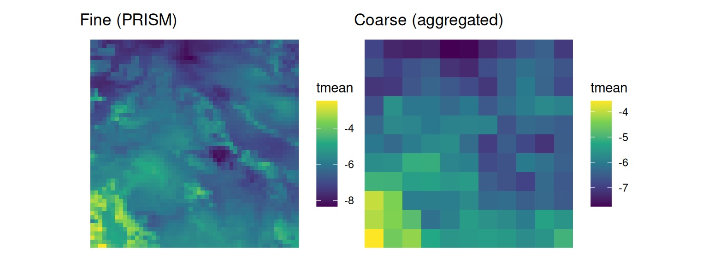
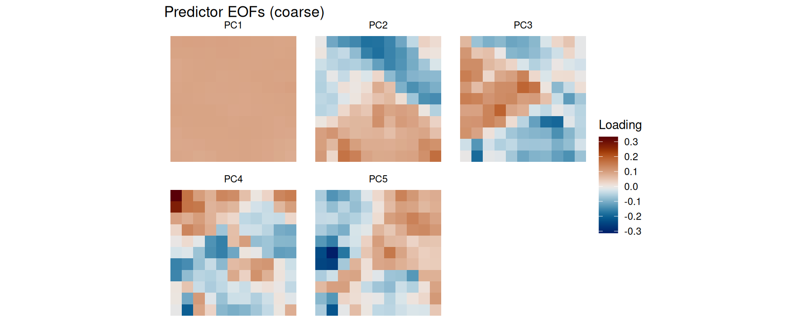
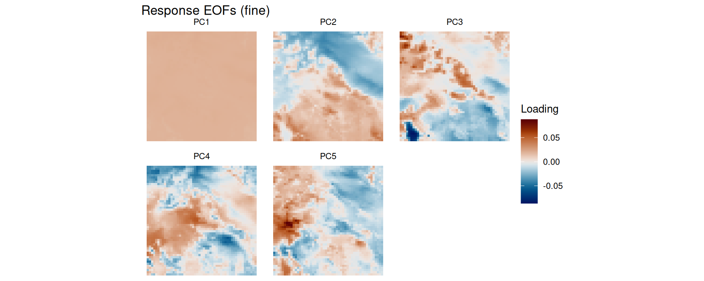
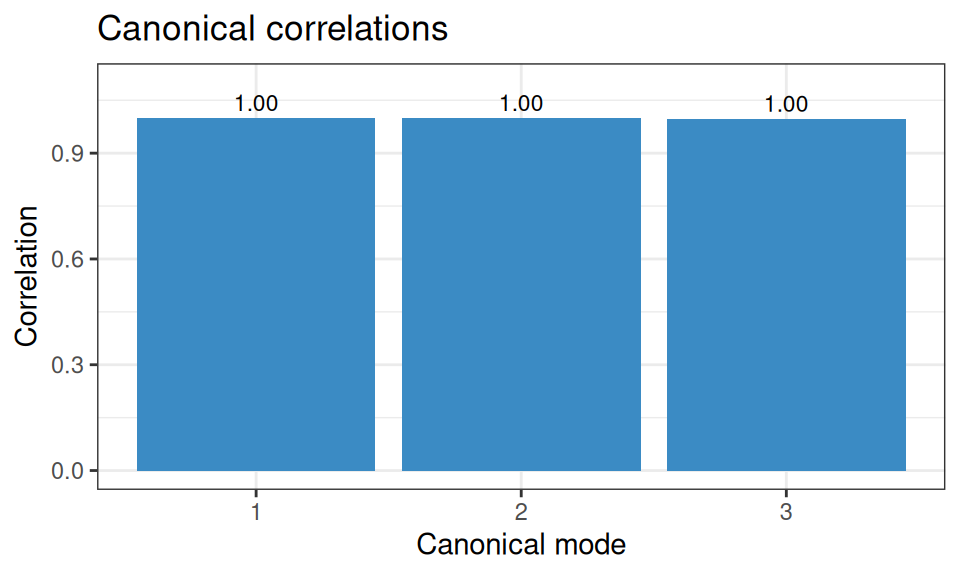
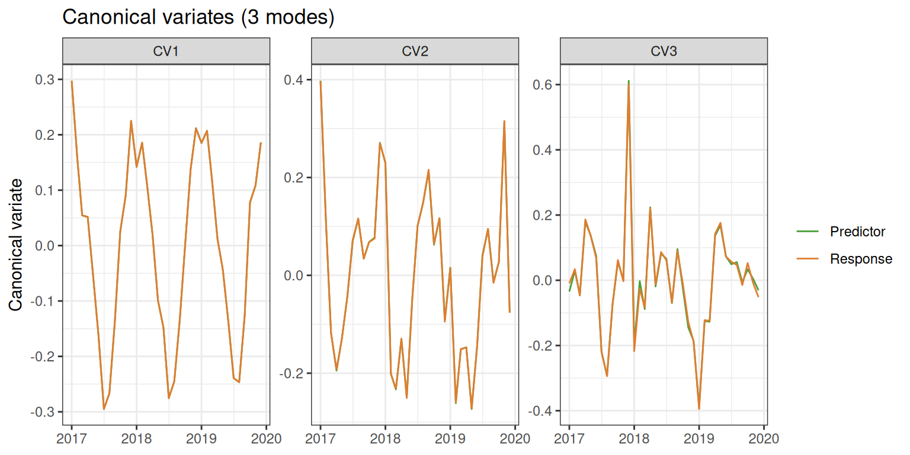
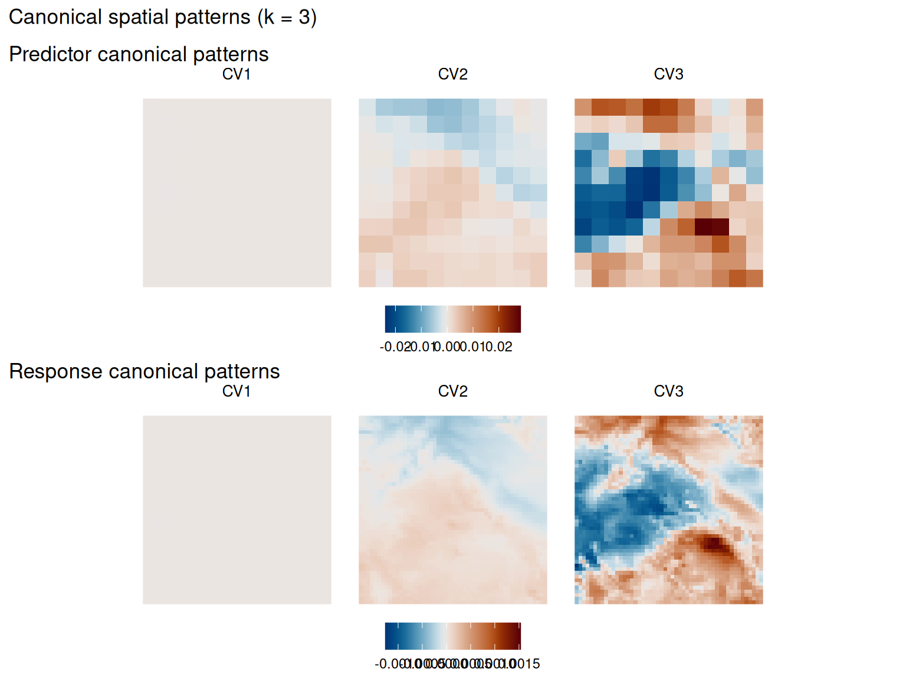
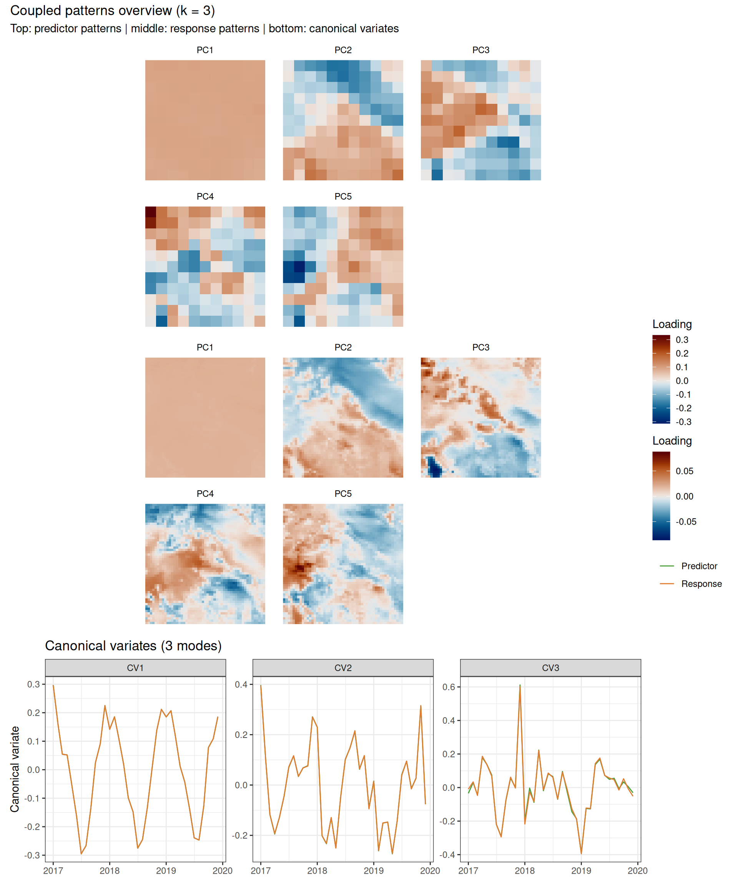
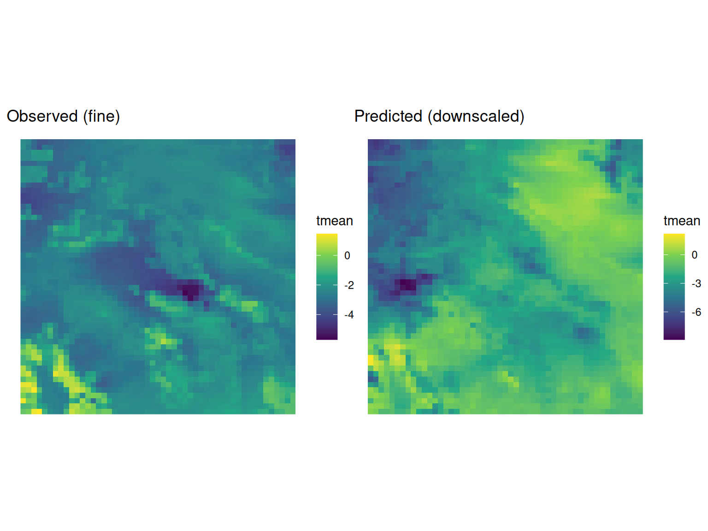

# Statistical Downscaling with CCA

``` r
library(tidyeof)
library(stars)
library(dplyr)
library(ggplot2)
```

## Overview

`tidyeof` supports statistical downscaling via Canonical Correlation
Analysis (CCA). The workflow is:

1.  Extract EOF patterns from both predictor (coarse) and response
    (fine) fields
2.  Couple them with CCA to find correlated modes of co-variability
3.  Predict fine-scale fields from new coarse-scale data

This vignette demonstrates the full downscaling pipeline.

## Setup: predictor and response data

For this vignette, we create a synthetic downscaling problem. The “fine”
field is the bundled PRISM temperature data. The “coarse” field is
derived by spatially aggregating it (simulating a coarse-resolution
model).

``` r
# Fine-resolution "observations"
fine <- system.file("testdata/prism_test.RDS", package = "tidyeof") |>
  readRDS()

# Coarse-resolution "model" -- aggregate to ~5x coarser grid
# In practice, this would be a GCM or reanalysis product
coarse <- fine |>
  st_warp(cellsize = 0.2, method = "average", use_gdal = TRUE, no_data_value = -99999) |>
  setNames(names(fine)) |>
  st_set_dimensions("band",
    values = st_get_dimension_values(fine, "time"),
    names = "time")
```

``` r
p1 <- ggplot() + geom_stars(data = fine[,,,1]) +
  scale_fill_viridis_c(na.value = NA) + coord_sf() + theme_void() + ggtitle("Fine (PRISM)")
p2 <- ggplot() + geom_stars(data = coarse[,,,1]) +
  scale_fill_viridis_c(na.value = NA) + coord_sf() + theme_void() + ggtitle("Coarse (aggregated)")
patchwork::wrap_plots(p1, p2)
```



## Step 1: Extract patterns

Extract EOF patterns from both fields. The number of modes `k` controls
how much spatial detail is retained. More modes capture finer structure
but risk overfitting in the CCA step.

``` r
pred_pat <- patterns(coarse, k = 5)
resp_pat <- patterns(fine, k = 5)
```

``` r
plot(pred_pat, type = "eofs") + ggtitle("Predictor EOFs (coarse)")
```



``` r
plot(resp_pat, type = "eofs") + ggtitle("Response EOFs (fine)")
```



## Step 2: Couple with CCA

[`couple()`](https://nick-gauthier.github.io/tidyEOF/reference/couple.md)
finds the linear combinations of predictor and response PCs that are
maximally correlated. The `k` argument controls how many CCA modes to
retain.

``` r
coupled <- couple(pred_pat, resp_pat, k = 3)
coupled
```

    ── Coupled Patterns Object ─────────────────────────────────────────────────────

    Method: cca

    CCA modes retained: 3

    Canonical correlations: 1, 1, and 0.998

    Predictor patterns: 5 PCs

    Response patterns: 5 PCs

### Diagnostics

Inspect the canonical correlations – these indicate the strength of the
predictor-response relationship for each mode:

``` r
get_canonical_correlations(coupled)
```

      mode correlation correlation_squared
    1    1   0.9999999           0.9999999
    2    2   0.9999594           0.9999187
    3    3   0.9981142           0.9962319

``` r
plot(coupled, type = "correlations")
```



Visualize canonical variates (the optimally-correlated time series from
each side):

``` r
plot(coupled, type = "canonical", side = "both")
```



Canonical spatial patterns show what spatial structures in the predictor
correspond to what structures in the response:

``` r
plot(coupled, type = "canonical_patterns", side = "both")
```



The combined view shows everything together:

``` r
plot(coupled)
```



## Step 3: Predict

[`predict()`](https://rdrr.io/r/stats/predict.html) takes new
coarse-resolution data and produces a fine-resolution prediction.
Internally it: projects the new data onto predictor EOFs, applies the
CCA transform, multiplies by response EOFs, and adds the response
climatology.

``` r
# Use the training data as a test (perfect predictor scenario)
predicted <- predict(coupled, coarse)
```

``` r
# Compare a single time step
t_idx <- 12
p1 <- ggplot() + geom_stars(data = fine[,,,t_idx]) +
  scale_fill_viridis_c(na.value = NA) + coord_sf() + theme_void() +
  ggtitle("Observed (fine)")
p2 <- ggplot() + geom_stars(data = predicted[,,,t_idx]) +
  scale_fill_viridis_c(na.value = NA) + coord_sf() + theme_void() +
  ggtitle("Predicted (downscaled)")
patchwork::wrap_plots(p1, p2)
```



### Amplitudes only

If you don’t need the full spatial reconstruction (e.g., for
diagnostics), set `reconstruct = FALSE` to get predicted response
amplitudes directly:

``` r
pred_amps <- predict(coupled, coarse, reconstruct = FALSE)
head(pred_amps)
```

    # A tibble: 6 × 6
      time         PC1     PC2     PC3    PC4   PC5
      <date>     <dbl>   <dbl>   <dbl>  <dbl> <dbl>
    1 2017-01-01 -758.  55.7   -36.1    34.8  -84.7
    2 2017-02-01 -408.  12.9   -16.4    14.6  -45.7
    3 2017-03-01 -143. -21.6     1.11    3.37 -15.5
    4 2017-04-01 -137. -30.7    -0.637  -6.03 -15.9
    5 2017-05-01  135. -17.5     5.78  -11.9   14.5
    6 2017-06-01  421.  -0.942  12.3   -17.0   46.5

## Common patterns for multi-source downscaling

When downscaling across multiple data sources (e.g., multiple reanalyses
or model runs), use
[`common_patterns()`](https://nick-gauthier.github.io/tidyEOF/reference/common_patterns.md)
to extract shared EOF patterns. This ensures all sources are projected
into the same EOF space, making their amplitudes directly comparable.

``` r
# Simulate two "sources" by splitting the time series
times <- st_get_dimension_values(coarse, "time")
source_a <- filter(coarse, time <= times[18])
source_b <- filter(coarse, time > times[18])

cpat <- common_patterns(list(a = source_a, b = source_b), k = 4, weight = TRUE)
cpat
```

    ── Common Patterns Object ──────────────────────────────────────────────────────

    Sources: "a" and "b"

    Shared EOF modes: 4

    ── Time steps per source ──

    a: 18

    b: 18

    ── Processing Options ──

    Scale: TRUE

    Rotate: FALSE

    Monthly: FALSE

    Weight: TRUE

Each source gets its own patterns object with source-specific amplitudes
and climatology, but shared EOF spatial patterns:

``` r
# The spatial patterns are identical; only amplitudes and climatology differ
cpat$a$eofs
```

    stars object with 3 dimensions and 1 attribute
    attribute(s):
                  Min.     1st Qu.     Median       Mean    3rd Qu.      Max.
    weight  -0.2334799 -0.05031055 0.03787486 0.02307869 0.09097917 0.2537912
    dimension(s):
       from to offset delta refsys point      values x/y
    x     1 11   -118   0.2  NAD83 FALSE        NULL [x]
    y     1 11  43.98  -0.2  NAD83 FALSE        NULL [y]
    PC    1  4     NA    NA     NA    NA PC1,...,PC4    

``` r
cpat$b$eofs
```

    stars object with 3 dimensions and 1 attribute
    attribute(s):
                  Min.     1st Qu.     Median       Mean    3rd Qu.      Max.
    weight  -0.2334799 -0.05031055 0.03787486 0.02307869 0.09097917 0.2537912
    dimension(s):
       from to offset delta refsys point      values x/y
    x     1 11   -118   0.2  NAD83 FALSE        NULL [x]
    y     1 11  43.98  -0.2  NAD83 FALSE        NULL [y]
    PC    1  4     NA    NA     NA    NA PC1,...,PC4    

You can then couple one source’s patterns with fine-scale observations,
and predict using another source’s patterns via the `predictor_patterns`
argument:

``` r
# Train CCA using source A
coupled_a <- couple(cpat$a, resp_pat, k = 3)

# Predict using source B's data, with B's climatology
predict(coupled_a, source_b_new, predictor_patterns = cpat$b)
```

## Next steps

- See
  [`vignette("cross-validation")`](https://nick-gauthier.github.io/tidyEOF/articles/cross-validation.md)
  for tuning `k_pred`, `k_resp`, and `k_cca`
- The
  [`reconstruct()`](https://nick-gauthier.github.io/tidyEOF/reference/reconstruct.md)
  function can also be used standalone for EOF-based field
  reconstruction (see
  [`vignette("eof-analysis")`](https://nick-gauthier.github.io/tidyEOF/articles/eof-analysis.md))

## References

- Barnett, T.P. & Preisendorfer, R. (1987). Origins and levels of
  monthly and seasonal forecast skill for United States surface air
  temperatures determined by canonical correlation analysis. *Monthly
  Weather Review*, 115(9), 1825-1850.
- Bretherton, C.S., Smith, C., & Wallace, J.M. (1992). An
  intercomparison of methods for finding coupled patterns in climate
  data. *Journal of Climate*, 5(6), 541-560.
- von Storch, H. & Zwiers, F.W. (1999). *Statistical Analysis in Climate
  Research*. Cambridge University Press.
