# EOF Analysis with tidyeof

``` r
library(tidyeof)
library(stars)
library(dplyr)
library(ggplot2)
```

## Overview

`tidyeof` provides tools for Empirical Orthogonal Function (EOF)
analysis of spatiotemporal data stored as `stars` objects. EOF analysis
decomposes a spatiotemporal field into:

1.  **Spatial patterns** (EOFs) – the dominant modes of variability
2.  **Time series** (principal components) – how each mode evolves over
    time
3.  **Eigenvalues** – how much variance each mode explains

This vignette covers the core EOF workflow: extracting patterns,
interpreting results, and reconstructing fields.

## Example data

The package includes a small test dataset: PRISM monthly mean
temperature over a portion of western North America (51 x 51 grid, 36
months).

``` r
temp <- system.file("testdata/prism_test.RDS", package = "tidyeof") |>
  readRDS()

temp
```

    stars object with 3 dimensions and 1 attribute
    attribute(s):
                 Min. 1st Qu.  Median     Mean 3rd Qu.   Max.
    tmean [°C] -8.343   1.679 7.57895 8.945718  16.253 27.791
    dimension(s):
         from  to offset    delta refsys                    values x/y
    x      50 100   -120  0.04167  NAD83                      NULL [x]
    y      50 100  46.02 -0.04167  NAD83                      NULL [y]
    time    1  36     NA       NA   Date 2017-01-01,...,2019-12-01    

## Climatology and anomalies

Before EOF analysis, it helps to understand the climatological baseline.
[`get_climatology()`](https://nick-gauthier.github.io/tidyEOF/reference/get_climatology.md)
returns a list with `mean` and `sd` stars objects.

``` r
# Annual climatology
clim <- get_climatology(temp)
plot(clim$mean, main = "Mean temperature")
```

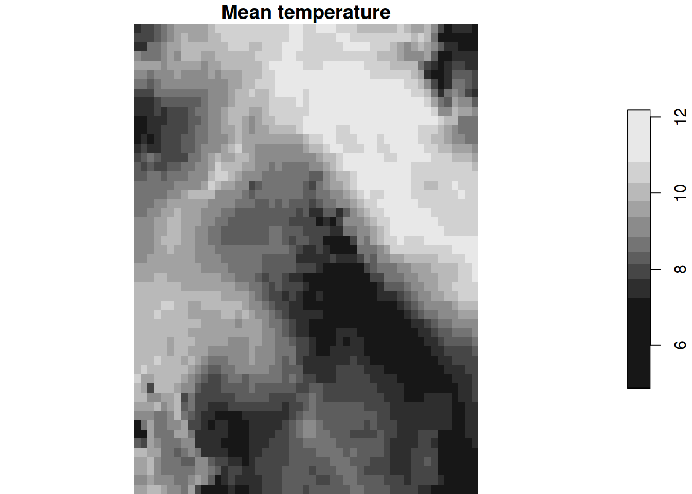

Monthly climatology captures the seasonal cycle:

``` r
monthly_clim <- get_climatology(temp, monthly = TRUE)
plot(monthly_clim$mean)
```

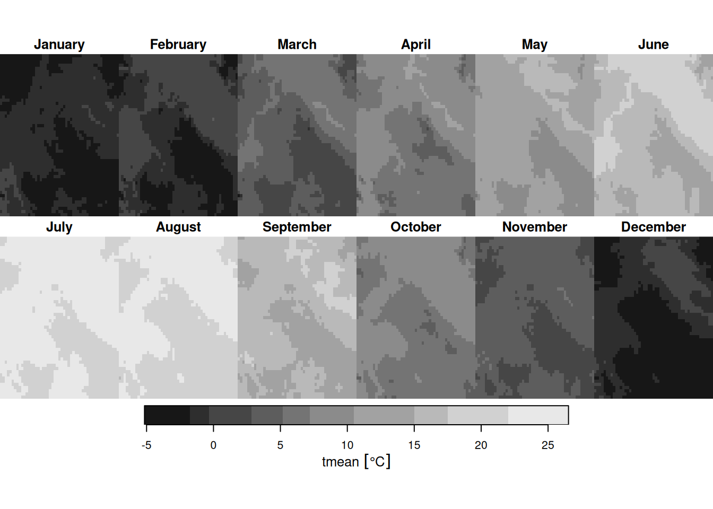

Anomalies are the departure from climatology. The `scale` option
additionally divides by the standard deviation, producing standardized
anomalies.

``` r
anom <- get_anomalies(temp)
anom_scaled <- get_anomalies(temp, scale = TRUE)
```

You can restore the original field from anomalies and climatology – they
are exact inverses:

``` r
restored <- restore_climatology(anom, clim)
max(abs(temp[[1]] - restored[[1]]), na.rm = TRUE) # ~machine epsilon
```

    1.776357e-15 [°C]

## Extracting patterns

The main function is
[`patterns()`](https://nick-gauthier.github.io/tidyEOF/reference/patterns.md).
It handles anomalization, optional area weighting, PCA, and optional
varimax rotation internally.

``` r
pat <- patterns(temp, k = 4)
pat
```

    ── Patterns Object ─────────────────────────────────────────────────────────────

    Modes: 4

    Time steps: 36 (2017-01-01 to 2019-12-01)

    ── Processing Options ──

    Scale: FALSE

    Monthly: FALSE

    Rotated: FALSE

    Area weighted: TRUE

    ── Eigenvalues (% variance) ──

    99.4, 0.4, 0, and 0

Key arguments:

- `k` – number of modes to retain
- `scale` – standardize anomalies before PCA (useful when combining
  variables with different units)
- `rotate` – apply varimax rotation for more localized, interpretable
  patterns
- `monthly` – use monthly climatology for anomalization
- `weight` – area-weight grid cells (default TRUE; accounts for
  latitude-dependent cell area)

## Plotting

The [`plot()`](https://rdrr.io/r/graphics/plot.default.html) method
produces a combined view of spatial patterns and amplitude time series:

``` r
plot(pat)
```

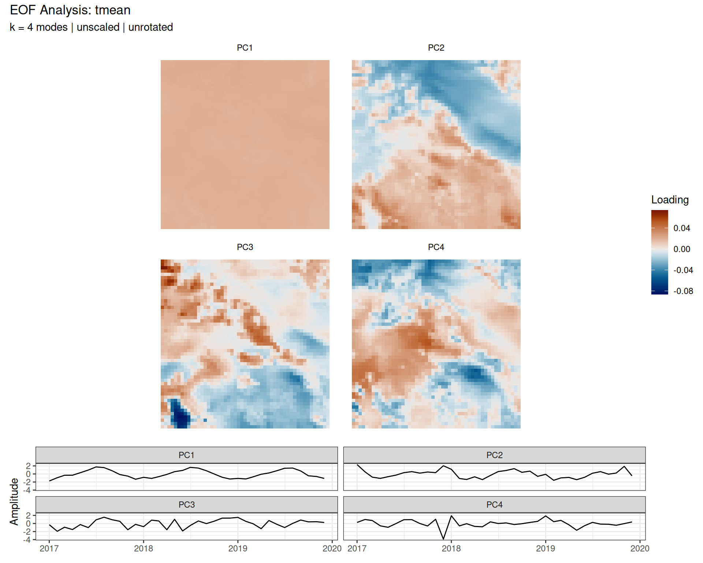

You can plot EOFs or amplitudes separately:

``` r
plot(pat, type = "eofs")
```

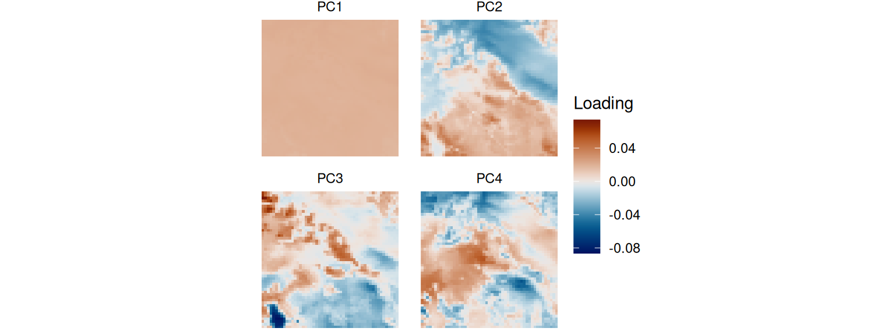

``` r
plot(pat, type = "amplitudes")
```

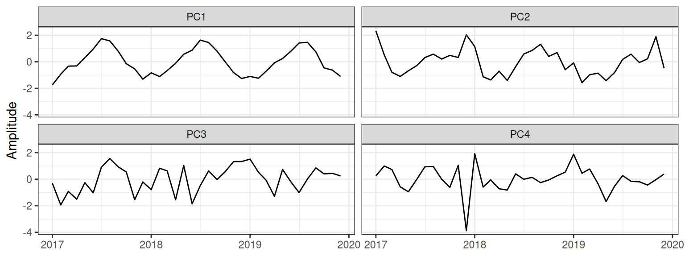

Amplitude scaling options control the y-axis:

- `"standardized"` (default) – unit variance
- `"variance"` – scaled by sqrt(eigenvalue), showing relative variance
  contribution
- `"raw"` – back-projected to original data units

``` r
plot(pat, type = "amplitudes", scale = "variance")
```

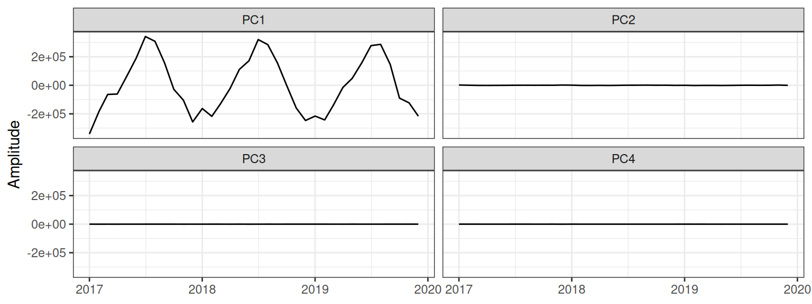

## Scree plot and significance

The scree plot shows eigenvalues with North et al. (1982) error bars.
Overlapping error bars indicate modes that form a degenerate multiplet
and should not be interpreted individually.

``` r
screeplot(pat)
```

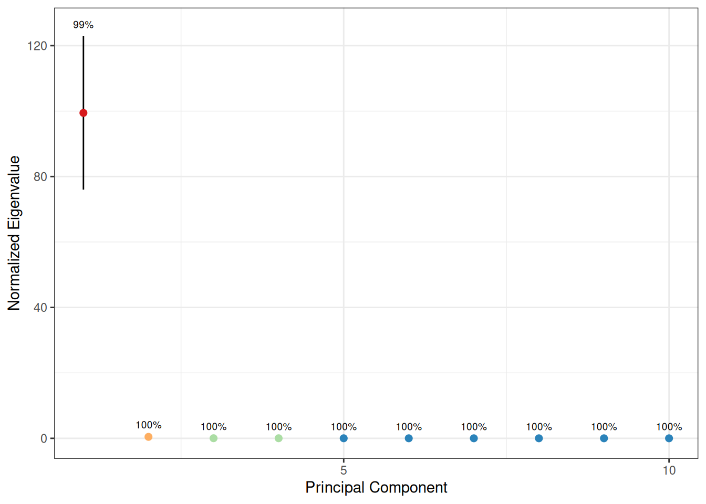

The `rule_n` option adds a blue dashed line showing the modified Rule N
significance boundary (based on the Tracy-Widom distribution). Modes to
the left of this line are statistically distinguishable from noise.

``` r
screeplot(pat, rule_n = TRUE)
```

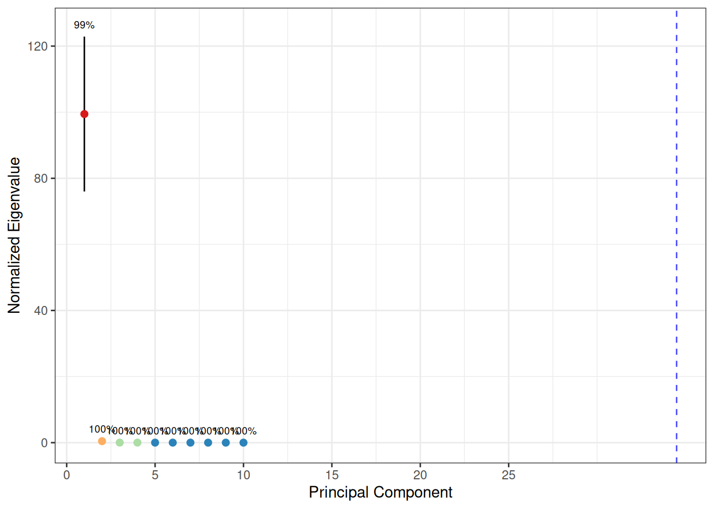

You can also test individual eigenvalues directly:

``` r
# Is the 3rd eigenvalue significant at p = 0.05?
eigen_test(
  pat$eigenvalues$eigenvalues,
  k = 3,
  M = length(pat$valid_pixels),
  n = nrow(pat$amplitudes)
)
```

    [1] TRUE

## Rotation

Unrotated EOFs are orthogonal, which is a mathematical convenience but
not always physically meaningful. Varimax rotation relaxes the
orthogonality constraint on spatial patterns (while keeping amplitudes
uncorrelated), often producing more localized and interpretable modes.

``` r
pat_rot <- patterns(temp, k = 4, rotate = TRUE)
plot(pat_rot)
```

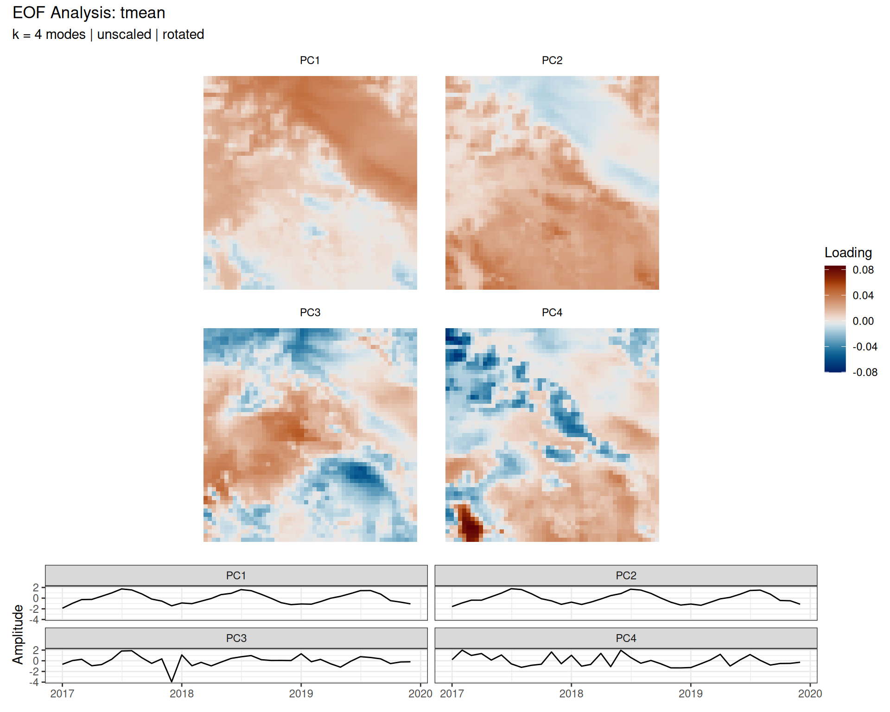

Compare rotated vs unrotated patterns:

``` r
p1 <- plot(pat, type = "eofs") + ggtitle("Unrotated")
p2 <- plot(pat_rot, type = "eofs") + ggtitle("Rotated")
patchwork::wrap_plots(p1, p2, ncol = 1)
```

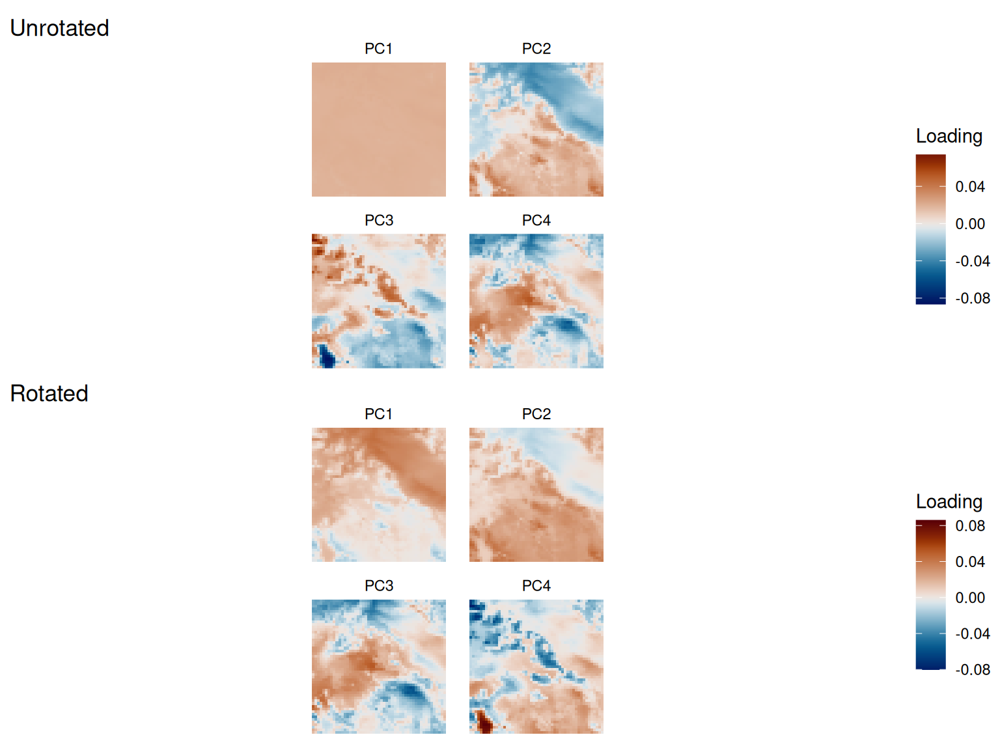

## Subsetting patterns

Use `[` to extract a subset of modes. This is useful for focusing on the
leading modes or for truncation experiments.

``` r
pat_sub <- pat[1:2]
pat_sub
```

    ── Patterns Object ─────────────────────────────────────────────────────────────

    Modes: 2

    Time steps: 36 (2017-01-01 to 2019-12-01)

    ── Processing Options ──

    Scale: FALSE

    Monthly: FALSE

    Rotated: FALSE

    Area weighted: TRUE

    ── Eigenvalues (% variance) ──

    99.4 and 0.4

## Reconstruction

[`reconstruct()`](https://nick-gauthier.github.io/tidyEOF/reference/reconstruct.md)
multiplies amplitudes by EOF patterns and adds back the climatology,
recovering the spatial field.

``` r
recon <- reconstruct(pat)
```

With fewer modes, the reconstruction is a smoothed approximation of the
original field. The reconstruction error decreases as more modes are
retained:

``` r
errors <- sapply(1:4, function(k) {
  recon_k <- reconstruct(pat[1:k])
  sqrt(mean((temp[[1]] - recon_k[[1]])^2, na.rm = TRUE))
})

data.frame(k = 1:4, rmse = round(errors, 4))
```

      k   rmse
    1 1 0.6414
    2 2 0.2845
    3 3 0.2469
    4 4 0.2112

For bounded variables like precipitation, the reconstructed field may
contain small negative values from truncation. To clamp these:

``` r
# pmax(.x, 0 * .x) preserves units
recon |> mutate(across(everything(), ~pmax(.x, 0 * .x)))
```

## Projection

[`project_patterns()`](https://nick-gauthier.github.io/tidyEOF/reference/project_patterns.md)
projects new data onto an existing set of EOF patterns, returning
amplitudes. This is useful for comparing how a new time period or
different dataset maps onto previously-identified modes.

``` r
# Project the original data back onto its own patterns (should recover stored amplitudes)
projected <- project_patterns(pat, temp)
all.equal(projected, pat$amplitudes, tolerance = 1e-10)
```

    [1] "Attributes: < Component \"class\": Lengths (3, 1) differ (string compare on first 1) >"
    [2] "Attributes: < Component \"class\": 1 string mismatch >"                                

## Teleconnections

[`get_correlation()`](https://nick-gauthier.github.io/tidyEOF/reference/get_correlation.md)
computes pixel-wise correlations between a spatial field and each PC
time series. This is the classic teleconnection map – it shows where
each mode has spatial influence.

``` r
cor_maps <- get_correlation(temp, pat)
ggplot() +
  geom_stars(data = cor_maps) +
  facet_wrap(~PC) +
  scale_fill_distiller(palette = "RdBu", limits = c(-1, 1), na.value = NA) +
  coord_sf() +
  theme_void() +
  labs(fill = "r")
```

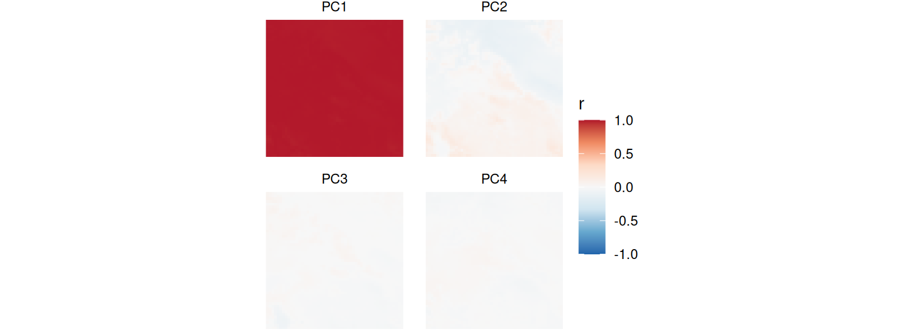

[`get_fdr()`](https://nick-gauthier.github.io/tidyEOF/reference/get_fdr.md)
adds field significance testing with FDR (false discovery rate)
correction, returning significance contour polygons:

``` r
fdr_contours <- get_fdr(temp, pat, fdr = 0.1)
```

    Warning in min(bb[, 1L], na.rm = TRUE): no non-missing arguments to min;
    returning Inf

    Warning in min(bb[, 2L], na.rm = TRUE): no non-missing arguments to min;
    returning Inf

    Warning in max(bb[, 3L], na.rm = TRUE): no non-missing arguments to max;
    returning -Inf

    Warning in max(bb[, 4L], na.rm = TRUE): no non-missing arguments to max;
    returning -Inf

``` r
ggplot() +
  geom_stars(data = cor_maps) +
  geom_sf(data = fdr_contours, fill = NA, color = "black", linewidth = 0.5) +
  facet_wrap(~PC) +
  scale_fill_distiller(palette = "RdBu", limits = c(-1, 1), na.value = NA) +
  coord_sf() +
  theme_void() +
  labs(fill = "r")
```


## Area weighting

By default,
[`patterns()`](https://nick-gauthier.github.io/tidyEOF/reference/patterns.md)
applies area weighting using `sqrt(cell_area / mean_area)`. This ensures
that grid cells at high latitudes (which cover less area on a regular
lat/lon grid) don’t dominate the PCA. You can access the weights
directly:

``` r
w <- area_weights(temp)
plot(w, main = "Area weights")
```

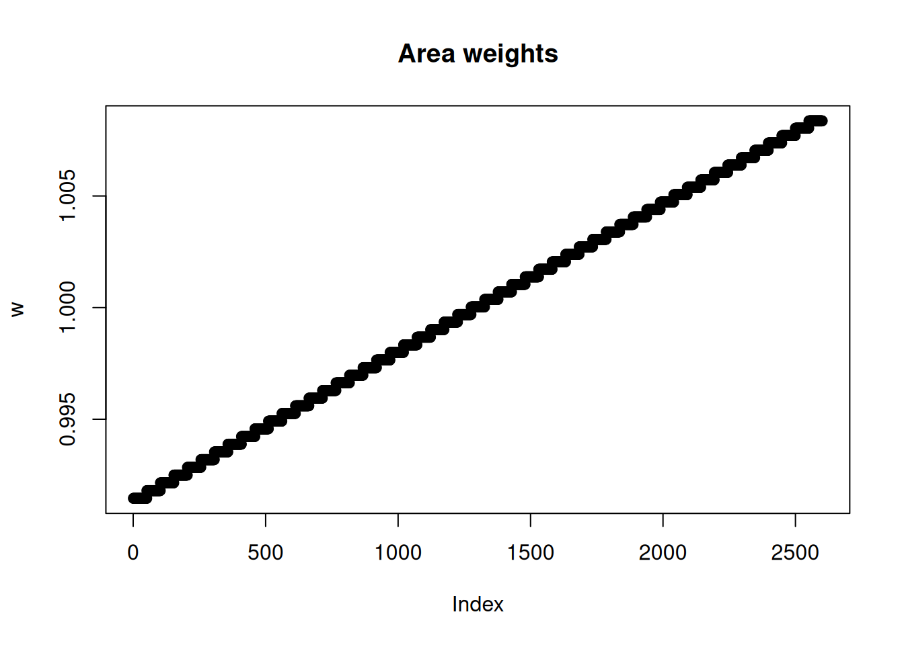

Disable weighting with `weight = FALSE` if your data is already on an
equal-area grid or if you want unweighted PCA.

## Overlays

The [`plot()`](https://rdrr.io/r/graphics/plot.default.html) method
accepts an `overlay` argument for adding geographic context (coastlines,
state boundaries, etc.):

``` r
# Example with US state boundaries (requires an sf object)
states <- sf::st_read("path/to/states.shp")
plot(pat, overlay = states)
```

## References

- North, G.R., Bell, T.L., Cahalan, R.F., & Moeng, F.J. (1982). Sampling
  errors in the estimation of empirical orthogonal functions. *Monthly
  Weather Review*, 110(7), 699-706.
- Hannachi, A., Jolliffe, I.T., & Stephenson, D.B. (2007). Empirical
  orthogonal functions and related techniques in atmospheric science: A
  review. *International Journal of Climatology*, 27(9), 1119-1152.
- Wilks, D.S. (2011). *Statistical Methods in the Atmospheric Sciences*
  (3rd ed.). Academic Press.
